

# Dokumentáció a Intergrációs és ellenőrzési technikák c. tárgy házifeladatához.

## CI és statikus ellenőrzés

### Git Flow

Git kliensnek mi a SourceTree-t választottuk, mely támogatja a Git Flow használatát.
Amikor klónoztam a Master-t:

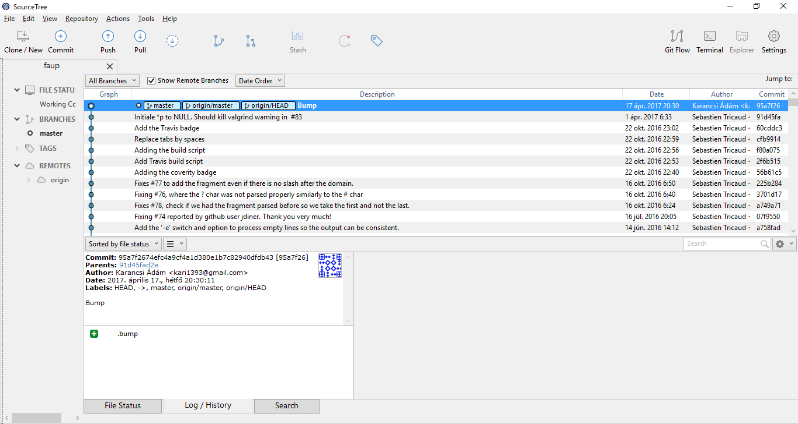

A Git Flow gomb megnyomásával lehetet, a helyi gépen inicializálni ezt a funkciót:

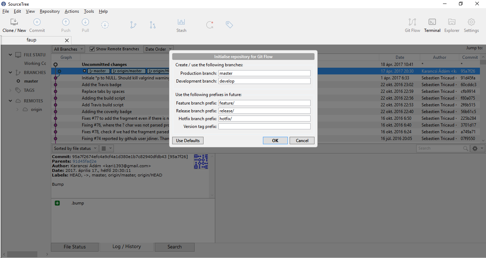

Miután ezt megtettük létrejön a Master mellett a Develop branch is:

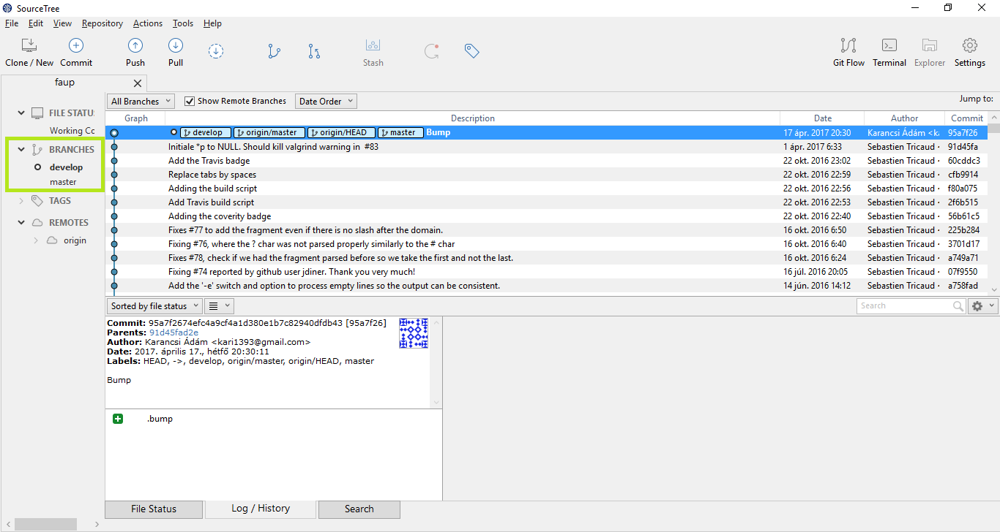

Ezek után új branch-et már csak a Git Flow gomb használatával éredemes/szabad létrehozni.
Lehet látni, hogy itt a Git Flow-nak megfelelő branch-eket ajánlja föl létrehozásra:

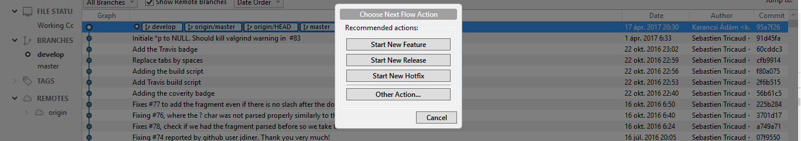

Létrehozok példaként egy **feature** branch-et:

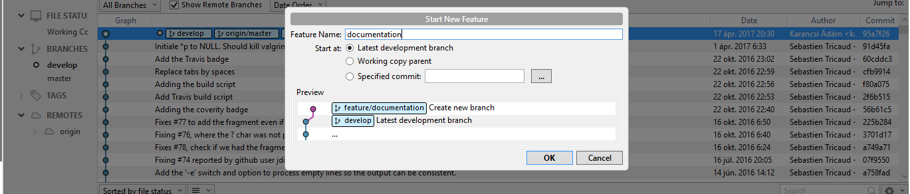

Az egyes branch csoportokat mappákba szervezi:

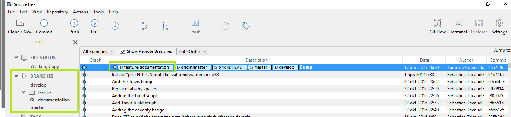

Ha kész vagyok, az alábbi módon zárhatom le (megint a Git Flow gomb használatával):

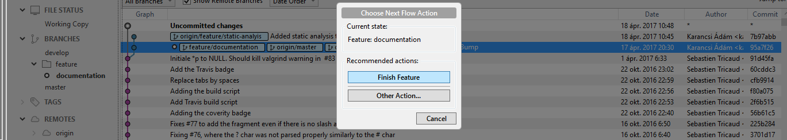

### 1-2. Build keretrendszer & CI beüzemelése: Cmake & Travis CI

A program egyszerű, C-ben íródott könyvtár/cli tool. Szerencsére a Travis támogatja a Cmake build keretrendszert.
A Travis a gyakorlaton megismert CI rendszer. Ugyan a projektben már volt egy Travis config fájl, de ellenőriztük a működését, illetve ezt valamelyest át kellett írnunk a Coverity használatához.

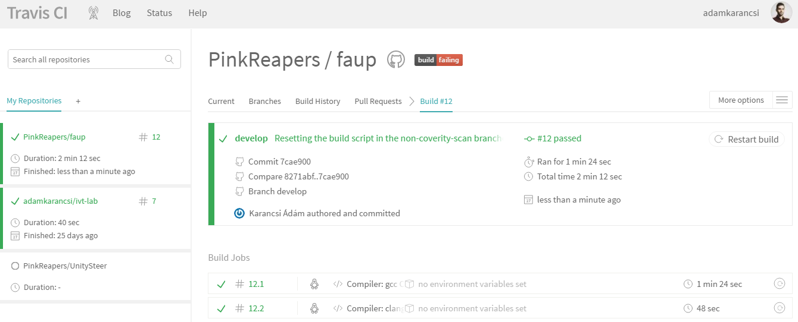

### 3. Statikus analízis eszköz futtatása: Coverity

A Coverity statikus kódellenőrzésre szolgál. A Coverity a Travis-en keresztül működik automatizáltan (commit hatására). A Coverity scan-jét elindító commithoz létrehoztunk egy külön ágat, ahogy azt az oldalukon javasolták, ugyanis limitált az analízis futtatások lehetősége egy csúszóablakban.

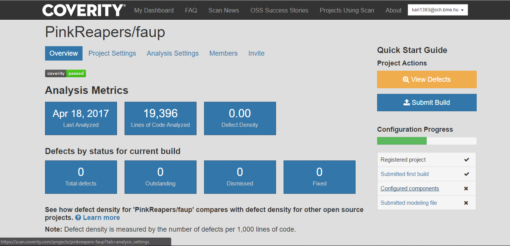

Láthatjuk, hogy nem talál hibákat a kódban.

### 4. Manuális kód átvizsgálás

Github segítségével vizsgáltuk a kódot. Érdekesnek találtuk a licensz header kommentet:

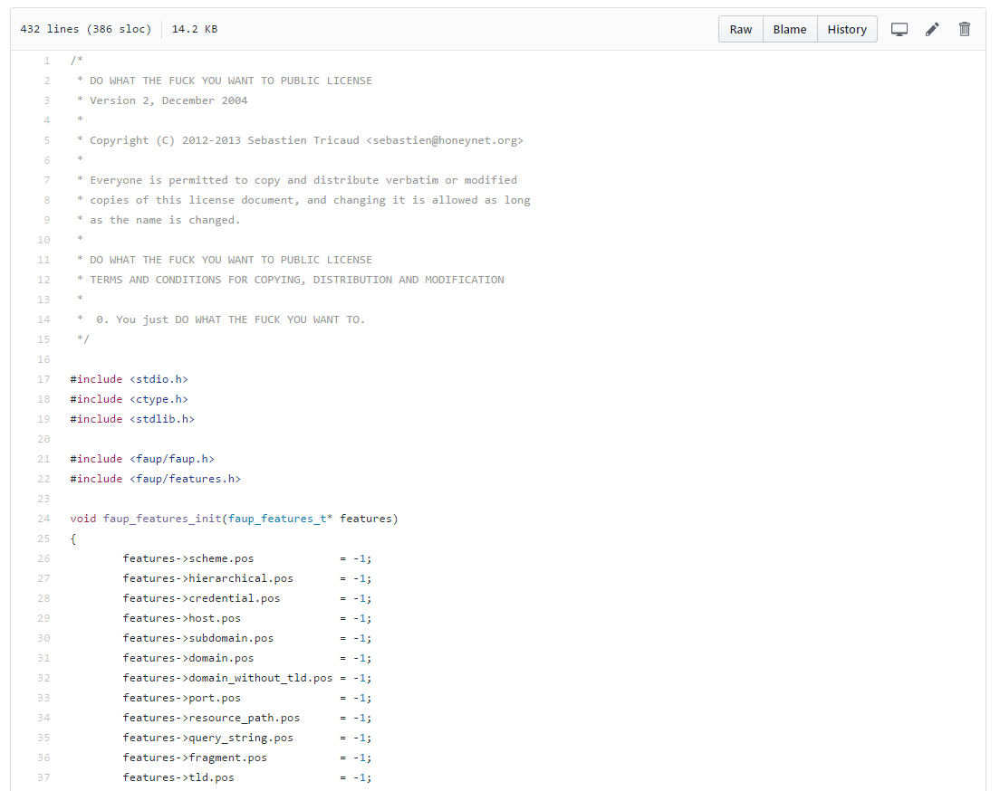

Az alkalmazás lelke, a fő ciklus az URL-ek vizsgálatára a feature.c fájlban található.

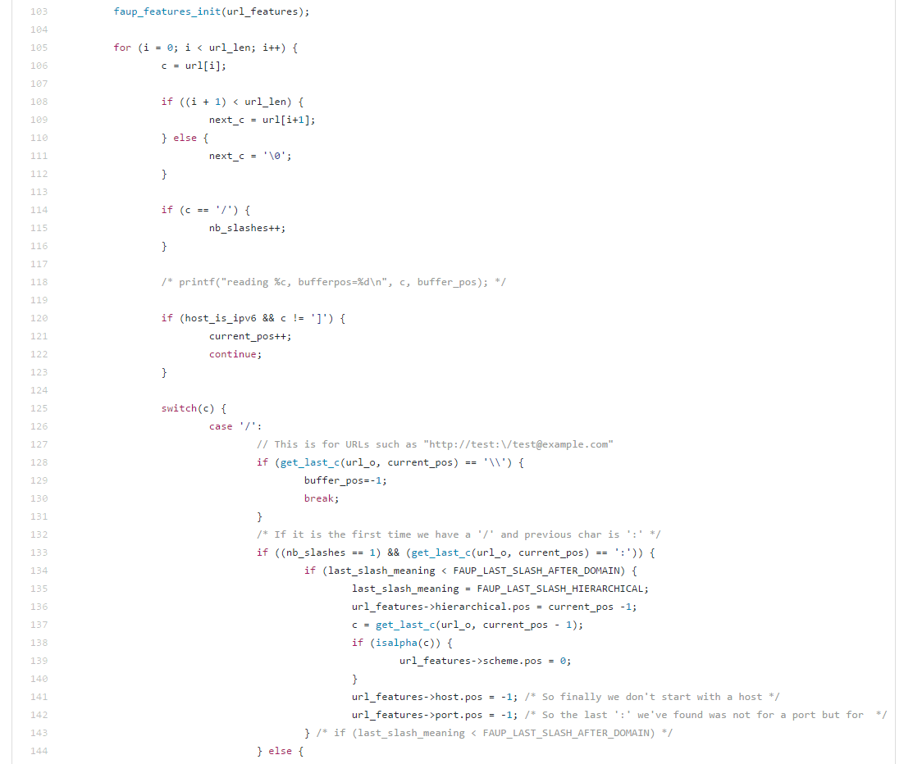

Itt látszik, hogy végigmászik a kapott stringen, és az aktuális karakterektől függően épít fel egy belső leíró struktúrát a megadott Url-ről.

### 5. Deployment segítése

Nem találtunk olyan use case-t, ahol ezt a projektet deployolni tudnánk/szeretnénk.